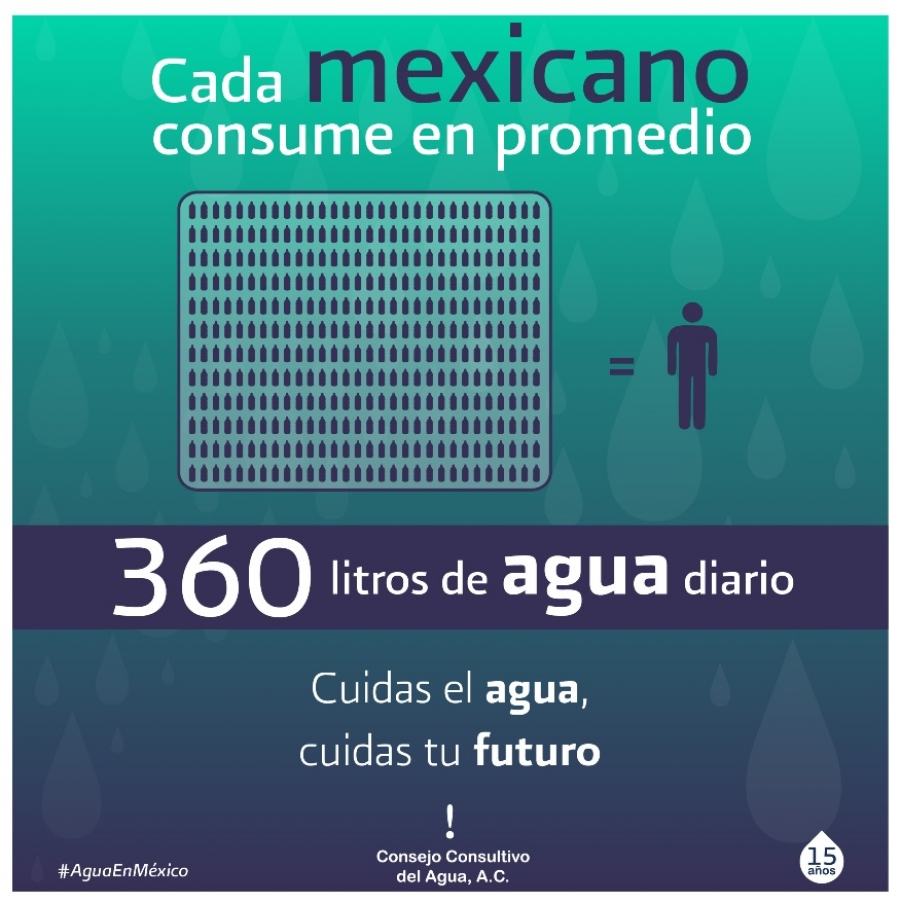

# Proyecto-Final---Analisis-de-Datos-con-Python

# Equipo 24 proyecto final

# Análisis del consumo de agua en México ⚙️

_Conociendo la gravedad de la situación que vivimos en la actualidad con el desabasto de agua en muchos estados de la republica Mexicana, es de suma importancia analizar algunos detalles que han influenciado a que el nivel de agua y los abastecimientos más importantes se vean afectados a lo largo del tiempo_



## Comenzando 🚀

_Puedes descargar el repositorio y consultar el Código en lenguaje de programación Python sobre el análisis realizado de las siguientes maneras:_

- Dando clic en **Code** en el repositorio y después **Download ZIP**..
- Haciendo un **Git clone** del repositorio directamente en tu computadora
- Ingresando a Google Colab [Proyecto Final](https://colab.research.google.com/drive/1KIAJThfCtS9SmW2FCOGBMOrNq8XrFa9U?usp=sharing)

### Prerrequisitos 📋

_Para poder observar en análisis, gráficas y datos que se presentan en este proyecto, debes tener instalado el lenguaje de programación **Python** en tu ordenador, así como cualquier IDE que pueda soportar este lenguaje, te recomendamos "VScode", "Anaconda", "JupiterNotebooks", pero una opción mas sencilla es utilizar y ejecutar el script en Google Colab si así lo deseas._

_De igual forma debes se debe tener en cuenta que se ocuparon data-sets de páginas como **Kaggle** o datos adquiridos diractamente del **Gobierno**, así que es de suma importancia tener descargados estos data-sets o tener la URL de cada uno de ellos para apreciar el análisis completo, estos data-sets se encuentran en este repositorio._


### Instalación 🔧

_Para el desarrollo del Código se utilizaron ciertas librerías de Python que facilitaron el análisis y la extracción de datos_

_Las librerías son las siguientes:_

```python
#Cargar las librerias
import pandas as pd
import requests
import matplotlib.pyplot as plt
from scipy import stats
import numpy as np
import seaborn as sns
from datetime import datetime
```

_Con todo lo anterior contemplado, se puede correr el Código y observar el análisis del proyecto._

## Autores ✒️

_Este proyecto fue realizado por el equipo 24 del programa Santander-DataScience, cuyos integrantes son:_

**Equipo 24:**
- **Oscar Cañongo** - \*\* - [OscarCanongo](https://github.com/OscarCanongo)
- **Daniel Arellano** - \*\* - [Tachuelin](https://github.com/Tachuelin)
- **Miguel Toledo** - \*\* -[josemigueltr](https://github.com/josemigueltr)